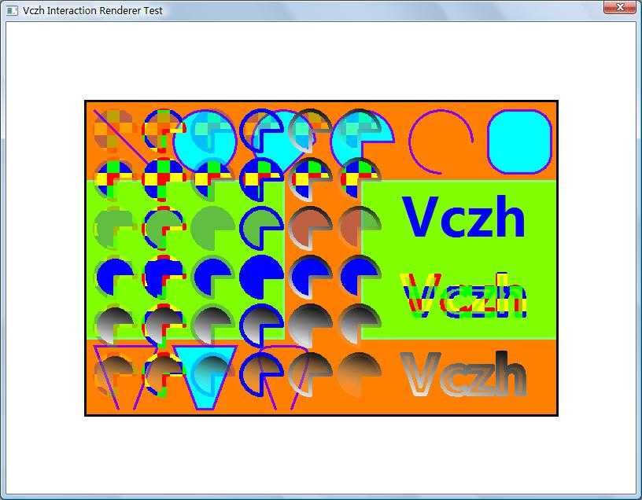
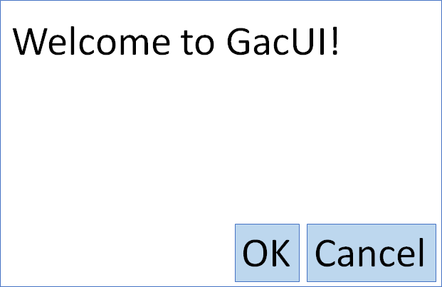
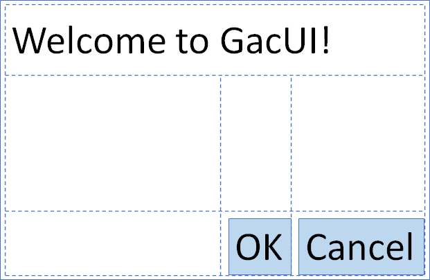
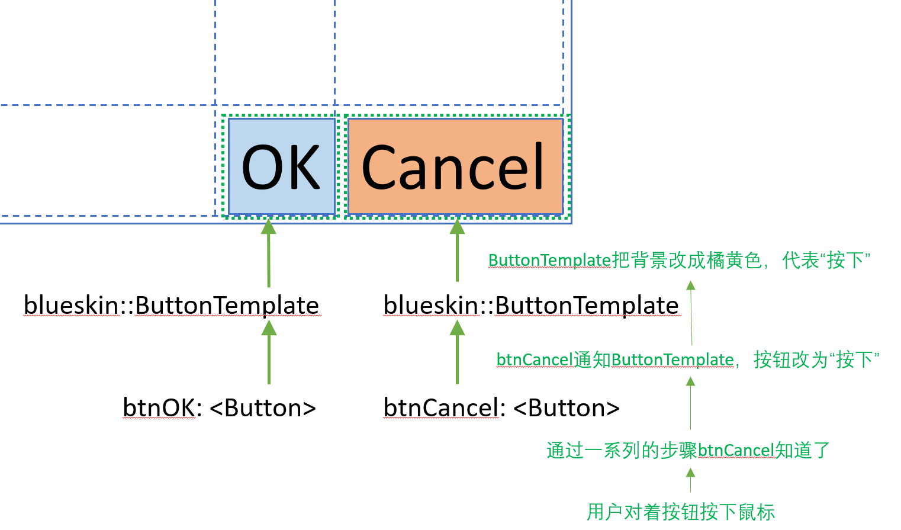

# GacUI：跨平台和渲染器

UI库跨平台的方法无非就是每个平台写一次。而如何把更多的共同点抽取出来，尽量的减少每个平台写一次的部分，是每一个跨平台的UI库的重点之一。GacUI的设计比较直接，所有平台相关的部分被集中到了[几个接口](https://github.com/vczh-libraries/GacUI/blob/master/Source/NativeWindow/GuiNativeWindow.h)里。每一次把GacUI一直到一个新的平台，就把所有的这些接口都重新实现一遍。目前GacUI能在Windows与macOS跑起来，以后还要逐渐支持UWP、命令行以及通过WASM让他跑到浏览器上去。简单地讲，所有的系统调用都从`INativeController`开始，这是一个单例。通过观察这个接口提供的各个服务，它本身就会慢慢引导你实现各种GacUI需要的与系统交互的功能，包括创建窗口等等。

其中最值得提到的是渲染的部分。实际上我并不想抽象渲染器。因为每一个渲染器的运行过程实在是大相径庭，如果为了开发简便而过度抽象，势必会牺牲某些平台的性能。不过我还是打算在2.0里推出一个2D绘图API，这组API就只是用来给app画画的，跟绘制控件本身并没有关系。设计这套架构的一个挑战，是渲染器本身也可能是跨平台的。一个平台上面可以有多个渲染器（譬如Windows上你就可以用GDI和Direct2D），一个渲染器也可能跨多个平台（譬如OpenGL）。所以为系统调用开发的代码，以及为渲染器开发的代码，势必本身也是解耦的。你不能说明明都是OpenGL，但是为Windows和Linux你都要各写一遍使用OpenGL绘制控件的代码，那就显得太愚蠢了。

设计都得从需求谈起，要讲GacUI如何把系统调用和渲染器都从实现里面隔离开，就得谈一谈GacUI是如何渲染控件的。

## 几次设计GUI库的尝试

### 第一次设计GUI库

我第一次做通用的控件库还是大一的时候。以前受到VB6以及Delphi的影响，对UI库的理解无非都是，用户创建一大堆控件接成一棵树，窗口修改大笑的时候自己去想办法布局，IO操作来了就直接dispatch到控件里，需要绘图了就从Windows地Paint函数一直调用洗澡去，每个控件自己负责自己的绘制。后来我尝试直接从Win32 API开始写app，发现也是这样的，那个时候就没怎么多想。因此那年第一次做一个UI库的时候，我也就理所当然地这么设计了，秉承着为开发游戏写library的精神，我毅然决然地使用了OpenGL，最后在做高级文字渲染的时候被劝退了。大三的时候我又不死心，又做了一遍。但是我的设计水平并没有得到提高，仅仅因为技术水平的提高而实现了更复杂的UI，于是得到了下面的东西，然后项目流产。


上面的设计有一个显著的坏处，在把Win32 API发挥到极致的.net Windows Forms里面就体现了出来，控件和布局混为一谈。最典型的就是`TableLayoutPanel`控件。这是一个控件，但是这个控件是没有交互功能的，他唯一的目标就是做layout。但是因为他被建模成了一个控件，就被赋予了渲染的义务，你依然可以修改它的边框和背景颜色什么的。第二个显著的坏处，就是既然每一个控件都要负责绘制自己，那不管你选择什么渲染技术，你都要把这套API需要的所有东西都带进控件里。于是在当年的这套控件库里面，每一个控件都会有一大堆OpenGL的概念放在private成员变量里。所有的代码被混淆了起来，越写越复杂。由于我大一的时候，算法数据结构设计模式什么都还没开始接触，最后便陷入了混乱，于是项目流产。当然就算是流产了，那也是像模像样的，只是再也无法重构下去了。

这个项目留下来的遗产，就是现在GacUI里面的[WinNativeWindow.cpp](https://github.com/vczh-libraries/GacUI/blob/master/Source/NativeWindow/Windows/WinNativeWindow.cpp)。有些人看着这份文件可能会问，为什么抽象了操作系统的接口，还要在里面再封装一次Win32 API。其实就是因为这份代码并不是从头写的。

### 第二次设计GUI库

于是一个很自然的想法，就是要把绘图的部分从控件里拿掉。想拿掉就得彻底，所有OpenGL的东西都不能出现在控件里。但是控件又必须把自己的信息都传递过去，否则就没办法绘图了。而且窗口也是特殊的，因为所有的绘图设备都是窗口创建的，而控件也仍然需要拿到这些设备才能绘制。因此当初我就做了一个实验，把使用Win32 API创建窗口的部分抽象掉。UI库需要一个本地窗口的时候，拿到的就只是一个窗口的抽象接口。

然后开始创建控件，每一个控件的皮肤也被抽象成了一个接口。譬如说按钮的皮肤，基本上就是一个被动接受信息的接口，他会不断地接受从控件来的命令，譬如更改字体啊，更改文字啊，更改颜色，更改位置啊啊。其次按钮放到不同的容器里面的时候，皮肤接口也会接到通知，这个信息用来把控件告知的位置换算成以窗口的一个角作为原点的坐标系。但是皮肤自己要绘制，其实还是要知道UI库用的是OpenGL。于是窗口的抽象接口还是留了一个后门，会暴露自己的OpenGL相关的信息。因此这种抽象是不够彻底的，说到底只是一次隔离，控件不需要关心渲染器，但是皮肤不仅要关心渲染器还要关心控件。

GacUI现在的`INativeController`的第一个版本就是从那个时候开始创建的。当时的代码长这样：

```C++
class INativeController : public Interface
{
public:
    virtual INativeWindow* CreateNativeWindow() = 0;
    virtual void           DestroyNativeWindow(INativeWindow* window) = 0;
    virtual INativeWindow* GetMainWindow() = 0;
    virtual void           Run(INativeWindow* window) = 0;

    virtual bool           InstallListener(INativeControllerListener* listener) = 0;
    virtual bool           UninstallListener(INativeControllerListener* listener) = 0;
    
    virtual int            GetScreenCount() = 0;
    virtual INativeScreen* GetScreen(int index) = 0;
    virtual INativeScreen* GetScreen(INativeWindow* window) = 0;
};
```

再看看今天的`INativeController`

```C++
class INativeController : public virtual IDescriptable, public Description<INativeController>
{
public:
    virtual INativeCallbackService*  CallbackService()=0;
    virtual INativeResourceService*  ResourceService()=0;
    virtual INativeAsyncService*     AsyncService()=0;
    virtual INativeClipboardService* ClipboardService()=0;
    virtual INativeImageService*     ImageService()=0;
    virtual INativeScreenService*    ScreenService()=0;
    virtual INativeWindowService*    WindowService()=0;
    virtual INativeInputService*     InputService()=0;
    virtual INativeDialogService*    DialogService()=0;
    virtual WString                  GetExecutablePath()=0;
};
```

功能多到塞不下了，只能切割成不同的service了。不过这也为2.0打了一点基础，像UWP、WASM和命令行这样的平台，GacUI基本上只能用单独的一个窗口来host里面的假窗口。UWP不同的窗口是基于不同的线程的，一下子想要支持这个觉得有点难先跳过。而命令行和WASM都没办法创建多窗口。因此可以预见到时候可能会有一些service的实现本身就可以跨平台，这样独立出来也好。

### 第三次设计GUI库

后来就有了上一篇博客提到的那个模板实验，但是那个时候渲染器已经换成了GDI。OpenGL在Windows上搞文字处理还是很蛋疼，上古时代唯一简便的方法就是用GDI先生成贴图然后送进显卡里当资源。那我干嘛不直接用GDI呢？反正Windows 7的GDI也有硬件加速了。我那个时候还做了另一个实验，用GDI实现GDI+的各种骚效果，也成功了。于是项目就换成了GDI。

当时的代码有些已经不见了，只剩下了cppblog上的几幅图。看着这些图还可以感受到时代的烙印。当年开发模板实验的时候用的还是Windows Vista，于是审美也被默默地影响了，画出来变成了这样：


那个时候还写了一个测试程序，使用GDI模拟了GDI+的可以使用各种半透明Brush来填充边框和内容的设定。仔细的话可以看得出来，里面穷举了各种Pen和Brush的组合，甚至连渲染文字的时候也有用。



不过当年自己设计的那套XML创建模板+简单数据绑定的系统还是过于粗糙了，于是等到真的拿来做GUI的时候，我还是选择了用代码创建。难看是难看了点，但是反正C++有各种技巧可以让他变得“好看”。又过了一段时间，这个项目也流产了，主要原因就是仅仅把渲染器的代码隔离了，而没有隔离渲染器的知识（也就是说我还得知道底下用的是GDI否则写不出皮肤的这件事）。

这个项目不仅最终启发了GacUI现在的设计，还留下了现在GacUI里面的[WinGDI.h](https://github.com/vczh-libraries/GacUI/blob/master/Source/NativeWindow/Windows/GDI/WinGDI.h)。这份对于GDI的封装是从另一个[对Win32 API封装的UI库](http://www.cppblog.com/vczh/archive/2008/08/25/59954.html)拿过来的，改吧改吧就用在了项目里面。后来由于这份代码实在是过于古老，与GacUI的.net式命名方式格格不入，还被我改了一遍，变成了今天的样子。

### 第四次设计GUI库

因此最后就迎来了GacUI。GacUI在这个基础上做了一个更优秀的设计，解决了上面说的这些问题。

以前在知乎上说过我UI做了十遍，其实是因为除了这条故事线以外，以前还为了各种项目开发和封装了各种不完全自绘的UI库，积累了丰富但是并没有什么卵用的经验。

## GacUI的执行过程与渲染架构

在GacUI的架构里面，控件和布局被分开成了两个层次的概念。图元也被抽象出来了。譬如说我需要一个长方形，那我就创建一个长方形的对象，附着在一个布局的对象上。控件本身只是一个view，他接受用户的输入，提供一些功能，通过操作布局和附着在布局上的图元来显示结果。这样皮肤接口的实现就被解放了，从直接绘制，变成了拼一颗布局图元树，然后根据控件的要求来修改这棵树上面的属性。至于图元本身的渲染就被隔离开了。每一个图元在创建的时候会跟系统要一个渲染对象，然后把自己的属性输入进去，而渲染需要的坐标本身则是布局来计算的。

举个例子，一个窗口有一行字和确定取消两个按钮，长这个样子：



在布局图元树里，长这个样子：



而里面的结构是这样的（简化过）

```Text
+<Bounds> + SolidBorder(blue)
+---+<Table> (3x3)
    +---+<Cell>
    |   +----<Bounds> + SolidLabel(Welcome to GacUI!)
    +---+<Cell>
    |   +---+<Bounds> + SolidBorder(blue)
    |       +---+<Bounds> + SolidBackground(light blue)
    |           +----<Bounds> + SolidLabel(OK)
    +---+<Cell>
        +---+<Bounds> + SolidBorder(blue)
            +---+<Bounds> + SolidBackground(light blue)
                +----<Bounds> + SolidLabel(Cancel)
```

这里面，`<Bounds>`、`<Table>`和`<Cell>`就是布局。每一种布局节点有自己的控制子节点位置的方法。一个布局节点可以附着一个图元，譬如`SolidBorder`、`SolidBackground`和`SolidLabel`等。每一个图元代表一种图形。一个附着在布局节点上的图元，会填充整个布局节点代表的范围。`SolidBorder`在一个`<Bounds>`上，那么`SolidBorder`画出来的边框就恰好是那个`<Bounds>`所占的位置。在按钮里面，`SolidBackground`要比`SolidBorder`四周都紧一个像素，不然边框就被覆盖了。

一旦针对每个布局节点的设定完成了，那么以后在窗口被拖动的时候，两个按钮会永远对齐在右下角。而且窗口它自己就会“知道”，它的宽度和高度受到了那一行字以及按钮的限制，不能无限变小。当一个窗口里面的东西多起来之后，可以组合的布局就让app的实现变得非常简单。控件本身是不参与渲染的，所以这一切发生的时候，控件完全不需要知道。

而“控件本身只是一个view”的意思，就是指这个按钮接受用户的输入，然后通过皮肤控制布局图元树里面的一棵子树的这件事：



用户按下了一个鼠标，事情发生的顺序就是这样的：

- 用户按下了鼠标
- INativeWindow的实现接收到了Windows发来的消息WM_LBUTTONDOWN，根据DPI设置变换了一下坐标系，广播了这个事件
- GuiWindow负责处理事件的部件(GuiGraphicsHost)接收到了这个消息，根据坐标查找到了相关的布局对象，定点发送了这个消息
- 鼠标消息会从点中的布局对象开始一级一级往上传播
- GuiButton由于监听了自己边框的鼠标消息，得知了这一事件的发生
- 对于GuiButton来说，鼠标按下了还没抬起来，状态发生了这个变化。于是这个状态由GuiButton重新发回给了ButtonTemplate
  - 这个时候，用户的输入开始转变为语义上的动作
- ButtonTemplate的职责就是修改布局图元树上的节点的属性，这个皮肤认为按钮被按下就应该是橘黄色的，于是修改了SolidBackground的颜色属性
  - 这个时候，语义动作转变为了视觉效果
- 布局图元树的某个一个节点的属性被改了，做了个标记，通知GacUI在适当的时候重新绘制窗口

在这个事件里，可能有其他的布局图元树的节点被修改了属性。于是在本次WM_LBUTTONDOWN结束之后，GacUI看一眼自己的标记，发现需要重绘了，于是开始启动重绘工作，并在必要的时候重新调整一下布局（举个例子，Cancel按钮的字改了，可能变得更长了，就要把OK挤到更远的地方）。

可以清晰地看出，GacUI的每一个部件的职责都是有限的，而且各个部件之间可以进行充分的沟通。

- 皮肤再也不需要管渲染是怎么完成的了，他要做的是控制布局图元树的一棵子树。这棵子树上所有的结构它都清楚地了解。自己接受来自控件的命令，每一个命令会有自己影响布局图元树的子树的方法。显而易见，不同的皮肤针对相同的命令会有不同的反应，譬如说修改的颜色可能不一样。
- 控件也不需要管皮肤长真么样子了。皮肤会告诉控件一些基本的信息，譬如说这棵子树的根节点是什么，有利于控件监听用户的输入。皮肤会把这些用户输入解读成语义上的命令，然后传达给皮肤。
- 控件也不需要管布局了。显然布局图元树才对布局负责。皮肤知道一个按钮应该长什么样子，所以它控制了属于按钮的这棵布局图元树的子树。而开发者知道app应该长什么样子，于是他会把控件放在他自己创建的窗口的布局图元树的节点上。于是控件就把自己皮肤的布局图元树接到了窗口的布局图元树上，于是整个app的界面变成了一棵巨大的布局图元树。Windows Forms的`TableLayoutPanel`那样的设计成为了历史。
- 如果整个app的皮肤一套换掉了，那每一个按钮都会把新的按钮皮肤提供的布局图元树接到窗口的布局图元树上，而原来的那棵子树就光荣退役了。

当然了，窗口也有自己的皮肤，控件也可以嵌套，那都是后话了。至少我们很清晰地明白了，在GacUI里面，布局节点确定了每一个画上去的图元在整个窗口中所占的位置，而附着在一个布局节点上的图元对象则负责确定画上去的是什么东西。于是现在就进入了跨平台的话题：图元是如何最终控制GDI、Direct2D、OpenGL、CoreGraphics等等等等数不尽的渲染器，从而最终把界面绘制出来的呢？

## 平台抽象与渲染器抽象之间的解耦

在上面的讨论中，我们知道系统调用`INativeController`的接口抽象掉了。这个接口是一个单例，熟悉设计模式的同学们都应该很清楚什么是单例。每一个平台都有一套`INativeController`的实现。一个操作系统可以有很多个平台，典型的就是Windows，Win32、UWP、命令行，就是不同的东西。当我们创建一个`GuiWindow`对象，这个对象就会执行`GetCurrentController->WindowService()->CreateNativeWindow()`，向`INativeController`要一个`INativeWindow`。因为创建了一个`INativeWindow`，系统里就出来一个窗口。要是没有窗口你还怎么往上面画东西呢？`GuiWindow`拿到了`INativeWindow`之后，就会把这个对象广播给以它为根节点的布局图元树上的每一个图元(`IGuiGraphicsElement`)。于是现在每一个图元都知道他自己在哪一个`INativeWindow`上了。这是第一步。

一个平台可能有多个渲染器的实现，甚至这个渲染器本身并不做渲染。譬如在我的设想中，UWP平台上的GacUI实现，渲染就是把布局图元树同步到UWP自己的那套东西上面去，并不调用绘图API。`INativeController`本身就会广播时间，不仅仅有全局鼠标钩子啊计时器这样的东西，每一次`INativeWindow`被创建和释放的时候，`INativeController`都会广播消息。需要知道这些消息的对象，可以实现一个`INativeControllerListener`，然后注册进去。渲染器本身也是一个`INativeControllerListener`，每次`INativeWindow`被创建的时候，就会开始为这个窗口做一些初始化。

对于GDI来说，窗口初始化就是要创建一个HBITMAP，每次需要刷新了就往这个HBITMAP上画，最后一次性刷新到窗口上去。对于Direct2D来说，窗口的初始化就是要创建一个render target，做类似的事情。OpenGL则更有趣，因为不同的平台上都有OpenGL，渲染的方法是一样的，但是初始化的方法大相径庭。于是对于OpenGL渲染器，大部分代码都可以共享，而初始化的这部分就每个平台做一次。

于是`INativeWindow`被创建好了之后，对应的渲染设备也被创建好了，这样就可以从一个`INativeWindow`得到渲染设备。这是第二步。

一个GacUI初始化的时候就要确定使用的渲染器。这个渲染器程序启动的时候，会为每一种图元绑定好一个图元渲染器的工厂示例。GacUI目前的实现是用图元的名字绑定的，其实不是太好，以后要改。不过尽管如此，实践表明在这种问题上那字符串做index对性能的影响微乎其微。每一个图元被（在第一不中）通知自己所依附的`INativeWindow`之后，就会去要这个图元渲染器的工厂示例。工厂示例创建了一个图元渲染器，这个图元渲染器当然知道他自己负责的是什么图元，也知道他自己需要在哪个`INativeWindow`上画，自然就知道应该去获得什么渲染设备了。这是第三步。

最后一步就容易了，每当GacUI觉得自己需要刷新了，就会挨个通知这些图元，这些图元就会通知自己的图元渲染器，图元渲染器就是干具体工作的地方了。

于是在这个架构里面，图元根本不需要自己跑在什么渲染器上，开发者只需要在初始化的时候说好要用什么渲染器，那么图元渲染器就会被连接到每一个图元上。图元渲染器的实现当然是每一个渲染器都会提供一份的，所以图元渲染器本身具有“现在开发者想用哪个渲染器”这样的知识，那他当然也就知道向谁要某个`INativeWindow`对应的渲染设备了。至此控件与平台、图元与渲染器之间的解耦就完成了。

### Win32平台下Direct2D渲染器的启动过程

我们可以看Direct2D作为例子。GacUI的开发者想要使用Direct2D渲染器在Win32平台上启动GacUI，那么典型的代码就是这样子：

```C++
int CALLBACK WinMain(HINSTANCE hInstance, HINSTANCE hPrevInstance, LPSTR lpCmdLine, int CmdShow)
{
    return SetupWindowsDirect2DRenderer();
}

void GuiMain()
{
    MyWindow window;
    GetApplication()->Run(&window);
}
```

- `SetupWindowsDirect2DRenderer`函数当然知道自己既Windows也Direct2D，于是他就调用`WinMainDirect2D`函数。这个函数主要的功能就是创建Win32版本的`INativeController`实现注册到单例里面，把`Direct2DWindowsNativeControllerListener`注册到`INativeController`里面，最后启动`SetWindowsDirect2DObjectProvider`函数以及`RendererMainDirect2D`函数。从此每当一个`INativeWindow`被创建的时候，`Direct2DWindowsNativeControllerListener`就会得到通知，并为每一个窗口创建一个`ID2D1HwndRenderTarget`。从`INativeWindow`到`ID2D1HwndRenderTarget`的知识，就可以通过调用`GetWindowsDirect2DObjectProvider`来获得。
- `RendererMainDirect2D`函数当然知道自己是Direct2D。在这个函数里面，它为每一个图元都注册了一个Direct2D相关的图元渲染器工厂示例。在每一个图元被创建之后，工厂示例就会创建相应的图元渲染器。这个渲染器理所当然的就知道`GetWindowsDirect2DObjectProvider`这件事。在做完了这些事情之后，`GuiApplicationMain`函数就被调用了。
- `GuiApplicationMain`已经是平台无关的函数了，它负责统筹GacUI的各项资源，初始化好后调用`GuiMain`。
- `GuiMain`就是用户实现的函数了。

在这个例子里面，`GuiMain`创建了`MyWindow`，它是`GuiWindow`的子类。于是在初始化函数里面，`GetCurrentController()->WindowService()->CreateNativeWindow`就被调用，于是：

- `WinMainDirect2D`注册进去的Windows版本的`INativeController`就开始发力了，创建出了一个`HWND`。
- `WinMainDirect2D`注册进去的`Direct2DWindowsNativeControllerListener`就会被通知，创建出了一个`ID2D1HwndRenderTarget`。
- `RendererMainDirect2D`注册进去的每一个图元渲染器工厂示例也开始发力了。一个简单的窗口上可能会有几十个图元，于是几十个图元渲染器就被挂在了布局图元树上。
- 然后`GetApplication()->Run(&window)`被执行，窗口第一次被渲染，这几十个图元渲染器纷纷调用`GetWindowsDirect2DObjectProvider`之后，通过它提供的函数获取到了相应的`ID2D1HwndRenderTarget`对象，开始画图。

一个GacUI窗口就显示在了用户的面前。

## 尾声

UI对于系统的功能需求是稳定的，GacUI在把GDI和Direct2D渲染器写好之后，`INativeController`这部分基本就没怎么修改了。在2014年，GacUI被darkfall同学首先移植到了macOS上，然后就去上班没有更新了。他的反馈是移植很容易，虽然`INativeController`接口很浓厚的Windows的味道，但是总的来说并没有对macOS的工作造成什么障碍。在这之后的6年里，GacUI发生了巨大的变化。到了2020年，roodkcab同学把已经没法编译的`iGac repo`做了一下更新，追赶到了GacUI的最新版本，发现着6年里面GacUI对系统层面的修改微乎其微，几乎所有的进度都是跨平台的。

这一定程度上表明了，GacUI的系统解耦工作是相当成功的。GacUI在设计上把对操作系统的需求隔离并最小化，于是每次一直到一个新的平台上，都不需要花多少努力就可以完成。而且`INativeController`对GacUI剩余的部分是一无所知，所以移植者只需要对目标平台有足够的了解，不需要深入了解GacUI具体是怎么运转的，也不妨碍实现`INativeController`的的工作。当然这个解耦也不完美，譬如GacUI实现菜单的功能需要挂一个全局的鼠标钩子，才能在用户点击桌面或者其他程序的时候把菜单关掉。这一点对Linux平台的移植造成了一些困难，使得`xGac repo`依赖了让一些程序员不开心的东西（逃。以后可能考虑把菜单的实现修改掉，尽可能脱离对全局鼠标钩子的依赖。
