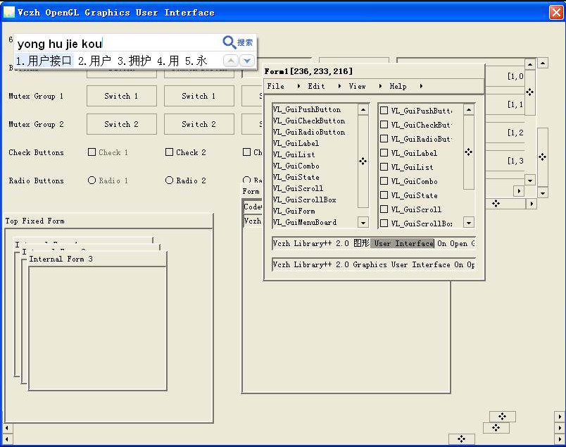

# GacUI：跨平台和渲染器

UI库跨平台的方法无非就是每个平台写一次。而如何把更多的共同点抽取出来，尽量的减少每个平台写一次的部分，是每一个跨平台的UI库的重点之一。GacUI的设计比较直接，所有平台相关的部分被集中到了[几个接口](https://github.com/vczh-libraries/GacUI/blob/master/Source/NativeWindow/GuiNativeWindow.h)里。每一次把GacUI一直到一个新的平台，就把所有的这些接口都重新实现一遍。目前GacUI能在Windows与macOS跑起来，以后还要逐渐支持UWP、命令行以及通过WASM让他跑到浏览器上去。简单地讲，所有的系统调用都从`INativeController`开始，这是一个单例。通过观察这个接口提供的各个服务，它本身就会慢慢引导你实现各种GacUI需要的与系统交互的功能，包括创建窗口等等。

其中最值得提到的是渲染的部分。实际上我并不想抽象渲染器。因为每一个渲染器的运行过程实在是大相径庭，如果为了开发简便而过度抽象，势必会牺牲某些平台的性能。不过我还是打算在2.0里推出一个2D绘图API，这组API就只是用来给app画画的，跟绘制控件本身并没有关系。设计这套架构的一个挑战，是渲染器本身也可能是跨平台的。一个平台上面可以有多个渲染器（譬如Windows上你就可以用GDI和Direct2D），一个渲染器也可能跨多个平台（譬如OpenGL）。所以为系统调用开发的代码，以及为渲染器开发的代码，势必本身也是解耦的。你不能说明明都是OpenGL，但是为Windows和Linux你都要各写一遍使用OpenGL绘制控件的代码，那就显得太愚蠢了。

设计都得从需求谈起，要讲GacUI如何把系统调用和渲染器都从实现里面隔离开，就得谈一谈GacUI是如何渲染控件的。

## 几次设计GUI库的尝试

### 第一次设计GUI库

我第一次做通用的控件库还是大一的时候。以前受到VB6以及Delphi的影响，对UI库的理解无非都是，用户创建一大堆控件接成一棵树，窗口修改大笑的时候自己去想办法布局，IO操作来了就直接dispatch到控件里，需要绘图了就从Windows地Paint函数一直调用洗澡去，每个控件自己负责自己的绘制。后来我尝试直接从Win32 API开始写app，发现也是这样的，那个时候就没怎么多想。因此那年第一次做一个UI库的时候，我也就理所当然地这么设计了，秉承着为开发游戏写library的精神，我毅然决然地使用了OpenGL，最后在做高级文字渲染的时候被劝退了。大三的时候我又不死心，又做了一遍。但是我的设计水平并没有得到提高，仅仅因为技术水平的提高而实现了更复杂的UI，于是得到了下面的东西，然后项目流产。



上面的设计有一个显著的坏处，在把Win32 API发挥到极致的.net Windows Forms里面就体现了出来，控件和布局混为一谈。最典型的就是`TableLayoutPanel`控件。这是一个控件，但是这个控件是没有交互功能的，他唯一的目标就是做layout。但是因为他被建模成了一个控件，就被赋予了渲染的义务，你依然可以修改它的边框和背景颜色什么的。第二个显著的坏处，就是既然每一个控件都要负责绘制自己，那不管你选择什么渲染技术，你都要把这套API需要的所有东西都带进控件里。于是在当年的这套控件库里面，每一个控件都会有一大堆OpenGL的概念放在private成员变量里。所有的代码被混淆了起来，越写越复杂。由于我大一的时候，算法数据结构设计模式什么都还没开始接触，最后便陷入了混乱，于是项目流产。当然就算是流产了，那也是像模像样的，只是再也无法重构下去了。

这个项目留下来的遗产，就是现在GacUI里面的[WinNativeWindow.cpp](https://github.com/vczh-libraries/GacUI/blob/master/Source/NativeWindow/Windows/WinNativeWindow.cpp)。有些人看着这份文件可能会问，为什么抽象了操作系统的接口，还要在里面再封装一次Win32 API。其实就是因为这份代码并不是从头写的。

### 第二次设计GUI库

于是一个很自然的想法，就是要把绘图的部分从控件里拿掉。想拿掉就得彻底，所有OpenGL的东西都不能出现在控件里。但是控件又必须把自己的信息都传递过去，否则就没办法绘图了。而且窗口也是特殊的，因为所有的绘图设备都是窗口创建的，而控件也仍然需要拿到这些设备才能绘制。因此当初我就做了一个实验，把使用Win32 API创建窗口的部分抽象掉。UI库需要一个本地窗口的时候，拿到的就只是一个窗口的抽象接口。

然后开始创建控件，每一个控件的皮肤也被抽象成了一个接口。譬如说按钮的皮肤，基本上就是一个被动接受信息的接口，他会不断地接受从控件来的命令，譬如更改字体啊，更改文字啊，更改颜色，更改位置啊啊。其次按钮放到不同的容器里面的时候，皮肤接口也会接到通知，这个信息用来把控件告知的位置换算成以窗口的一个角作为原点的坐标系。但是皮肤自己要绘制，其实还是要知道UI库用的是OpenGL。于是窗口的抽象接口还是留了一个后门，会暴露自己的OpenGL相关的信息。因此这种抽象是不够彻底的，说到底只是一次隔离，控件不需要关心渲染器，但是皮肤不仅要关心渲染器还要关心控件。

GacUI现在的`INativeController`的第一个版本就是从那个时候开始创建的。当时的代码长这样：

```C++
class INativeController : public Interface
{
public:
    virtual INativeWindow* CreateNativeWindow() = 0;
    virtual void           DestroyNativeWindow(INativeWindow* window) = 0;
    virtual INativeWindow* GetMainWindow() = 0;
    virtual void           Run(INativeWindow* window) = 0;

    virtual bool           InstallListener(INativeControllerListener* listener) = 0;
    virtual bool           UninstallListener(INativeControllerListener* listener) = 0;
    
    virtual int            GetScreenCount() = 0;
    virtual INativeScreen* GetScreen(int index) = 0;
    virtual INativeScreen* GetScreen(INativeWindow* window) = 0;
};
```

再看看今天的`INativeController`

```C++
class INativeController : public virtual IDescriptable, public Description<INativeController>
{
public:
    virtual INativeCallbackService*  CallbackService()=0;
    virtual INativeResourceService*  ResourceService()=0;
    virtual INativeAsyncService*     AsyncService()=0;
    virtual INativeClipboardService* ClipboardService()=0;
    virtual INativeImageService*     ImageService()=0;
    virtual INativeScreenService*    ScreenService()=0;
    virtual INativeWindowService*    WindowService()=0;
    virtual INativeInputService*     InputService()=0;
    virtual INativeDialogService*    DialogService()=0;
    virtual WString                  GetExecutablePath()=0;
};
```

功能多到塞不下了，只能切割成不同的service了。不过这也为2.0打了一点基础，像UWP、WASM和命令行这样的平台，GacUI基本上只能用单独的一个窗口来host里面的假窗口。UWP不同的窗口是基于不同的线程的，一下子想要支持这个觉得有点难先跳过。而命令行和WASM都没办法创建多窗口。因此可以预见到时候可能会有一些service的实现本身就可以跨平台，这样独立出来也好。

### 第三次设计GUI库

后来就有了上一篇博客提到的那个模板实验，但是那个时候渲染器已经换成了GDI。OpenGL在Windows上搞文字处理还是很蛋疼，上古时代唯一简便的方法就是用GDI先生成贴图然后送进显卡里当资源。那我干嘛不直接用GDI呢？反正Windows 7的GDI也有硬件加速了。我那个时候还做了另一个实验，用GDI实现GDI+的各种骚效果，也成功了。于是项目就换成了GDI。

当时的代码有些已经不见了，只剩下了cppblog上的几幅图。看着这些图还可以感受到时代的烙印。当年开发模板实验的时候用的还是Windows Vista，于是审美也被默默地影响了，画出来变成了这样：


那个时候还写了一个测试程序，使用GDI模拟了GDI+的可以使用各种半透明Brush来填充边框和内容的设定。仔细的话可以看得出来，里面穷举了各种Pen和Brush的组合，甚至连渲染文字的时候也有用。


不过当年自己设计的那套XML创建模板+简单数据绑定的系统还是过于粗糙了，于是等到真的拿来做GUI的时候，我还是选择了用代码创建。难看是难看了点，但是反正C++有各种技巧可以让他变得“好看”。又过了一段时间，这个项目也流产了，主要原因就是仅仅把渲染器的代码隔离了，而没有隔离渲染器的知识（也就是说我还得知道底下用的是GDI否则写不出皮肤的这件事）。

这个项目不仅最终启发了GacUI现在的设计，还留下了现在GacUI里面的[WinGDI.h](https://github.com/vczh-libraries/GacUI/blob/master/Source/NativeWindow/Windows/GDI/WinGDI.h)。这份对于GDI的封装是从另一个[对Win32 API封装的UI库](http://www.cppblog.com/vczh/archive/2008/08/25/59954.html)拿过来的，改吧改吧就用在了项目里面。后来由于这份代码实在是过于古老，与GacUI的.net式命名方式格格不入，还被我改了一遍，变成了今天的样子。

### 第四次设计GUI库

因此最后就迎来了GacUI。GacUI在这个基础上做了一个更优秀的设计，就是把布局和控件分开了。图元也被抽象出来了。譬如说我需要一个长方形，那我就创建一个长方形的对象，附着在一个布局的对象上。控件本身只是一个view，他接受用户的输入，提供一些功能，通过操作布局和附着在布局上的图元来显示结果。这样皮肤接口的实现就被解放了，从直接绘制，变成了拼一颗布局图元树，然后根据控件的要求来修改这棵树上面的属性。至于图元本身的渲染就被隔离开了。每一个图元在创建的时候会跟系统要一个渲染对象，然后把自己的属性输入进去，而渲染需要的坐标本身则是布局来计算的。

以前在知乎上说过我UI做了十遍，其实是因为除了这条故事线以外，以前还为了各种项目开发和封装了各种不完全自绘的UI库，积累了丰富但是并没有什么卵用的经验。

## GacUI的皮肤设计与渲染过程

## 平台抽象与渲染器抽象之间的解耦

## 尾声
